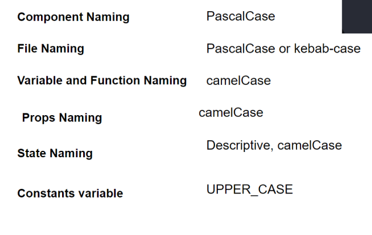

Holdbar CS team

Description: An internal system for Customer Success people to create, edit and check company accounts; search, create and edit giftcards.

Table of contents: 

Feature branching system
**Feature branches**: Each new feature or enhancement is developed in its own feature branch, branched from `develop`. Naming format: `feature/feature-name`.

Naming conventions

**Branch Names**: Use hyphenated, lowercase names (e.g., `feature/login-form`).

Folder structure

Collaboration

Project management: Figjam https://www.figma.com/board/sTZJ9ECuPtDdsQNzy6ir9x/Holdbar?node-id=0-1&node-type=canvas&t=QLnW2T8JOzAv5mpn-0

Slack/Google Calendar

Pull Request (PR) Workflow
Scheduling and meetings
Friday Weekly meeting after work